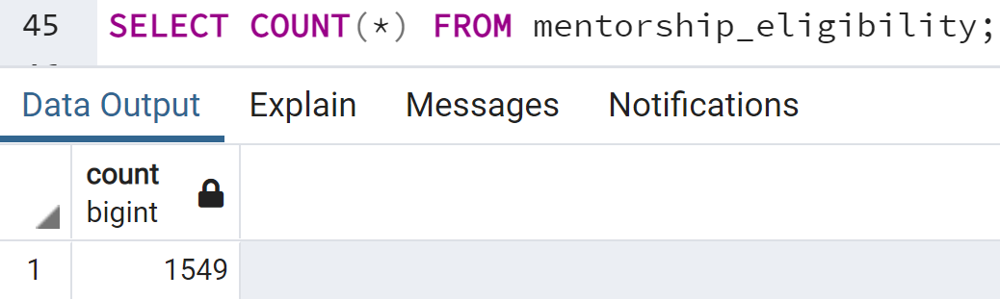

# Pewlett-Hackard-Analysis

## Overview
The purpose of this analysis was to asses how many employees will be retiring in the near future, how this will impact each of the roles at pewlett-hackard. In addition, we queried the list of employees in order to determine how feasible implementing a mentorship program would be. We also consider how database could be improved in order to produce more informative analysis.

## Results
* By using the following queries we see that 30.13% of employees are in their retirement years. As will be discussed later this figure and those below include employees who have already left PH.

*The count of all employees in their retirment years*

*The count of all employees*

* When we queried the number of employees in their retirement years and then grouped by the role of the employees, we noticed that 2 out of the 5 active managers could potentially retire. If they did, PH would be left with 6 departments without an active manager.
  
*Count of employees in their retirement years grouped by role*

* When we filter the table of eligible mentors to the manager role we see that there are 0 managers who are eligible to mentor. In order to address the unmanaged departments at PH, the training of new managers should be a priority.
  
*The count of employees eligible to be a mentor, filtered to the Manager role*

* Counting the number of employees eligible for mentorship we see that there are 1549 mentors compared to 90,389 roles which need to be filled. This would result in an mentee:mentor ratio of roughly 58:1. However, we note that number of roles to be filled include those where the employee has previously left the company and the number of eligible employees includes only those who are currently employed by PH. Due to this, the two values are not directly comparable. 
  
*The count of all employees whom are eligible to be a mentor*

## Summary 
The original analysis performed shows that 90,389 roles will need to be filled due to the upcoming retirement wave. However, this figure includes employees who have already left the company. By creating a new table of unique emloyees who are retiring and then filtering to only active employees we see that the actual number of roles which need to be filled is 72,458. The query used to create the table can be viewed further [here](./Resources/uniques_with_dates.png) and the query used to filter the resulting table can be viewed by clicking [here](./Resources/current_count.png).  
  
As we noted in the last bullet of the results section the average number of mentees that each mentor would need to have if the program was implemented would be unfeasibly high at 58. First we created a table similar to the one in part 2 of the Results section except such that it only counts the retirees whom are still employed by PH. Then we used this table to find the ratio of roles that will need to be filled to the number of mentors in that role (code [here](./Resources/Employee_Database_challenge.sql#L82)). As we can see from the results below, the mentorship program may be viable in some roles were the ratio is low enough such as "Assistant Engineer" or "Engineer" but is definitely not viable for the role of "Senior Engineer" since there would be 158 mentees assigned to each mentor. (The [null] value for Managers is due to there being no managers available to be mentors) 
  
*Ratio of mentees:mentor needed to implement the mentorship program, per role at PH*
